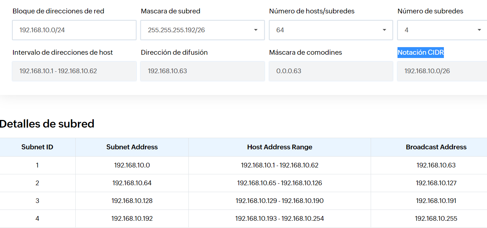
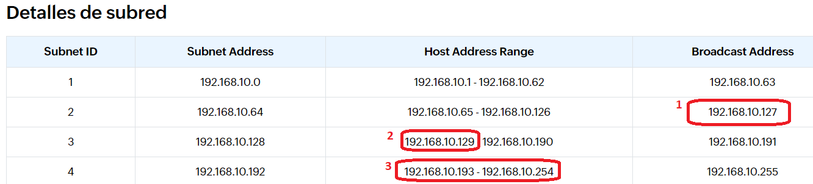

# Problema descomposició de xarxes tipus C, màscara fixe.

Un Ajuntament ha comprat bloc de pisos d’un banc pel bé comú dels seus habitants.
Tenen clar que confien en el nostre institut per a dissenyar una xarxa local.
L’adreça de xarxa que han contractat és la **192.168.10.0/24**

Aquest edifici té **3 pisos i una planta baixa**. 
Per diversos motius, volen aprofitar aquesta IP per tot l'edifici i crear **4 subxarxes** de màscara fixa.

Tenen clar que el **número de hosts útils** que necessitaran en cada planta (subxarxa), serà com a màxim **45**.

### 1. Calcula la màscara de subxarxa adaptada (/25, /26 ...) 	

### 2. Omple la taula de subxarxes necessàries. 

### Un cop omplerta, respon:

 #### 3.1. Quina és la adreça de broadcast de la 1a xarxa?
 
 #### 3.2. Quina  és la ip del 1r host de la 2a xarxa?
 
 #### 3.3. Quina és la ip de l’últim host de l’última xarxa?
 
 Per resoldre el problema pots utilitzar una <a href="https://www.site24x7.com/es/tools/ipv4-subredes-calculadora.html">calculadora online.</a>

# Solució al problema.

1. Posem les dades que ens diu l'enunciat a la calculadora:

Bloque de direcciones de red = 192.168.10.0/24

Número de hosts/subredes = 4 

2. Ens recalcula el següent:

Número de hosts/subredes = 64

Mascara de subred = 255.255.255.192/26

Máscara de comodines = 0.0.0.63

### Calcula la màscara de subxarxa :

Notació binaria

255.255.255.192

Notació adaptada

/26

<em>Explicació:</em>

Necessitem  24 bits per representar una IP de tipus C com la que tenim. 

Sabem que és tipus C perquè si traduïm a binari el 192 veiem que els 2 primers bits són 0.  

### Omple la taula de subxarxes necessàries. 

3. La calculadora ens genera tota la taula de subxarxes.

4. Tenint aquesta taula, podem respondre.

 #### 3.1. Quina és la adreça de broadcast de la segona xarxa?
 
 192.168.10.127
 
 #### 3.2. Volem connectar una impressora 3D a la tercera IP de la tercera subxarxa, quina IP tindrà ? 
 
 192.168.10.129 és la primera IP de tercera subxarxa.
 
Per tant, la **IP 3 = tercera** de la **subxarxa 3 = tercera** és **192.168.10.131**
 
 #### 3.3. A la IP 192.168.10.195 hi ha connectat un servidor web. A quina subxarxa pertany ?  

La **quarta = 4.**

Podem veure que el rang d'IP's de la quarta subxarxa està entre:

192.168.10.192 - 192.168.10.254

A sota teniu un esquema que ho explica:

