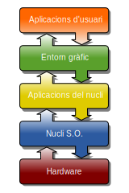

# M01-UF1-NF1-Components del Sistema Informàtic.

## Definicions.

**Dades.-** Es la unitat mínima que forma part de qualsevol informació. Les dades per si mateixes no ens serveixen per gaire.

**Informació.-** Es el conjunt de dades, figures o paraules estructurades de tal manera que tinguin sentit per a una persona. 

**Informàtica.-** Es l’acrònim de “Informació Automàtica”. Podem definir <em>la informàtica com la ciència que estudia el tractament automàtic i racional de la informació.</em>

**Bioinformàtica.-** La bioinformàtica és l'aplicació de tecnologies computacionals i l'estadística a la gestió i anàlisi de dades biològiques; amb la intenció d'estudiar, analitzar i processar informació genètica, molecular i clínica per generar nou coneixement, noves eines diagnòstiques i noves teràpies.

---

**Programa.-** És una seqüència d’instruccions accions definides a priori que poden ser executades per part d’un procesador que tenen la finalitat
d'oferir als/les usuaris/es una funcionalitat: tractament d'informació, edició de documents, navegador ...

**Procés.-** Es cada una de les tasques realitzades per un ordinador. També es considera com procés cadascuna de les instàncies d’un programa. 

Simplificant, **un procés és un programa en execució.**

**Servei.-** A Linux, també conegut com a daemon. És un programa que s'està executant en segon pla, fora del control de l'usuari. Normalment, el Sistema Operatiu
arrenca una serie de serveis/dimonis necessaris pel seu funcionament.

---


**Ordinador.-** Dispositiu físic construït a base de components electrònics i electromecànics situats dins d’una carcassa, que ha estat dissenyat per a 
tractar instruccions concretes, les quals prenen la forma de programes. Es qui executa el tractament automàtic de la informació. La paraula Ordinador, deriva de la paraula francesa "Ordinateur”, En molts països hispano-parlants de cultura tècnica
més influenciada por USA, s’utilitza el terme "computadora"; més semblant al seu equivalent anglès "Computer".
<em>Exemples més comuns:</em> ordinador de sobretaula (desktop), ordinador portàtil (laptop), telèfon mòbil que incorpori un SO 
(smartphone, els SO més comuns són Android, iOS), tablet. 

**Sistema Informàtic** és el conjunt d'elements necessaris per a la realització i l’explotació d'aplicacions informàtiques. 
S’hi inclouen els elements de programari, de maquinari i els éssers humans.

#### En aquest mòdul estudiarem l'ús dels Sistemes Operatius, especialment els més comuns per a desenvolupadors: Linux i Windows.

---

# Sistema Operatiu
És un Sistema Informàtic que utilitzen els ordinadors per a facilitar administració dels seus recursos:
el maquinari (CPU, memòria, discs durs, etc...), el programari, i com els usuaris hi interactuen.
El diseny es basa en una estructura en capes.



Les capes que conté un Sistema Operatiu són:
- El nucli o Kernel.
- Les aplicacions del nucli
- L'entorn gràfic

<em>Exemple: A Ubuntu l'entorn per defecte és el Gnome, però si volem se li pot canviar per altres, com KDE.</em>
<em>També hi ha sistemes operatius sense entorn gràfic, com per exemple FreeDOS o algunes de Linux (Slitaz)</em>

## Part física d'un sistema informàtic (maquinari).

El maquinari (hardware) fa referència a tot allò que podem veure i tocar de l'ordinador.

#### Parts del maquinari.

La **placa mare o placa base (en anglès motherboard)** és la targeta de circuits impresos central a l'ordinador que conté
el microprocessador, la memòria RAM del sistema, circuits electrònics de suport i targetes adaptadores addicionals: pantalla, xarxa, teclat, etc...
Aquestes targetes solen realitzar funcions de control de perifèrics, com monitors, impressores, unitats de disc, etc.

En resum, solen contenir:
- Connector a la font d'alimentació.
- Sòcols per a posar-hi una o més CPU.
- Un o més ventiladors per evitar sobrescalfament
- Ranures per a la memòria RAM.
- Xipset: conté connectors als processadors, memòries, unitats d'emmagatzematge secundari (pex. disc dur i connectors USB), targetes gràfiques (GPU).


## Part lògica d'un sistema informàtic (programari)
  
El programari (software) és compost per tot allò que fem servir en el camp de la informàtica que no podem veure ni tocar.

<em>Exemples: jocs d’ordinadors, programes de comptabilitat, sistemes operatius, etc...</em>

#### Tipus de programari:
  
**Programari bàsic del nucli** 
Conjunt de programes que l’equip físic necessita per a tenir capacitat de treballar. Aquests configuren el que s’anomena sistema operatiu.
Exemples: Unix, GNU/Linux, Windows, OS X, Solaris, Android, iOS, etc...

**Programari d'aplicació** 
Són els programes que fan que l’ordinador desenvolupi una tasca determinada.
Exemples: Libre Office, Firefox, Gimp, etc...  

**Processadors de llenguatges de programació**
S'utilitzen per a què els éssers humans amb formació prèvia puguin crear programari eficientment i amb un llenguatge més entenedor que el del processador. Quasi tots els programes que s'executen en un ordinador han estat escrits en algun llenguatge de programació.
crear programari més fàcilment i eficientment.
Llenguatges de programació moderns: Python, Java, PHP, C#, Fortran, JavaScript.
  
Amb el terminal dels sistemes operatius (shell de Linux bash, Powershell de Windows) també es poden crear programes senzills però són més adients
  per a fer operacions d'organitzar el disc dur i el sistema operatiu.

## Part humana d'un sistema informàtic (usuàries)

És la persona que utilitza la informàtica com a eina per a desenvolupar el seu treball o com a ajuda en una activitat.

Cal tenir uns coneixements informàtics bàsics i, particularment, tenir uns grans coneixements sobre el funcionament de l’aplicació informàtica que està utilitzant.

``` Per exemple, l’usuari d’aplicacions ofimàtiques: fulls de càlcul, presentacions... ```

#### Personal informàtic

És el conjunt de persones que desenvolupen diferents funcions relacionades amb la utilització dels ordinadors en una empresa. Controlen i manipulen les màquines perquè donin el servei adequat als usuaris.

Es poden dividir en dos grups:

- Administració del sistema: assegurar el bon funcionament del sistema informàtic i la xarxa (hardware).
- Desenvolupament d'aplicacions: crea i manté aplicacions informàtiques (software).
