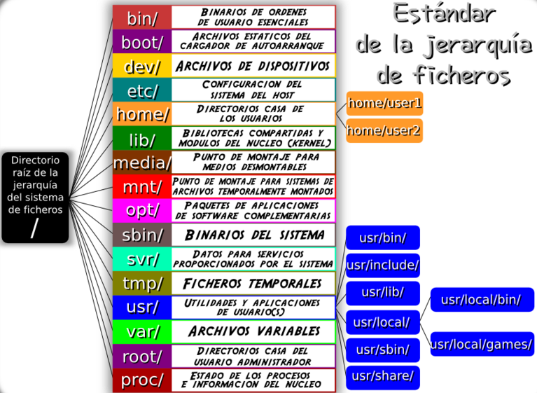

# M01-UF1-NF1-Introducció al terminal de Linux. Comandes de rutes, de gestió de fitxers i directoris.

## Bloc 0: Instal.lació programes.

Abans que res, hem d'obrir el terminal de Linux. La seva icona està representada per una pantalla negra en diverses distribucions (les basades en Debian o Ubuntu). També pots obrir-lo amb la combinació de tecles **Ctrl + Alt + T**

El programari de Linux es pot gestionar amb programes gràfics (pex. Centre Software Ubuntu), però el més habitual és gestionar-lo des del terminal.

Exemple, si volem instal·lar l'editor de text **nano**:
```console
sudo apt update
sudo apt install nano
```

Descomposem les parts de la comanda, per entendre-la:

- sudo → Comanda que permet executar com a usuari admin.
Alternativa: sudo su 
- apt → gestor de paquets que usen distros de Linux basades en Debian: Ubuntu, Mint...
- install → Li diem al apt que volem instal.lar (altres opcions: update, upgrade, autoremove, purge...)
- nano → El nom del programa, és un editor de text del terminal.

En aquest cas, s'instal·len molts programes alhora.

### Exercici: Instal.la 2 programes més amb la comanda apt install.

Útils:
- nano
- inxi
- tree
- htop
- git

Programes no tant útils però curiosos:
- sl
- oneko
- cowsay

Per executar el programa instal.lat posa el seu nom:
```console 
inxi
```

---

## Teoria Bloc 1: «Comandes de rutes (pwd, cd, ls) i ajuda»

Abans de començar a moure'ns pel terminal, cal entendre com funciona la estructura de directoris que hi ha en una partició d'un disc amb Linux.

### Estructura de directoris a Linux.



Fixeu-vos que els usuaris es troben dins del directori **/home/**

També, que no hi ha lletres d'unitats com C: D: E: A: sinó que el contingut de les unitats està repartit, a les carpetes **/dev/** de devices.

Els dispositius extraibles (pendrives, ISO's ...) es creen a la carpeta **/media/** en general.

Sempre parlarem de directoris a Linux (però el concepte és el mateix que el de la carpeta).

### Comandaments de rutes (per moure'ns): cd, ls, pwd 

Repassem la gestió de rutes de Linux i com funcionen les comanda cd, pwd i ls.

Les rutes serveix per moure'ns pels diferents directoris del sistema. 

Carpetes especials:
El directori arrel del sistema és root i es representa amb una barra:

```console
/
```

A diferència de Windows, que la carpeta arrel és:
C:\

O el nom de la unitat assignada.


El directori de l'usari és la **home**, per defecte se situa a:

```console
usuari1@mint:~$ /home/<nom_usuari>
```

```console
miquel@mint:~$ /home/miquel/Documents/dawbio-m01.txt
```

Tant a Linux com a Windows, per defecte la carpeta de cada usuari conté altres carpetes:
Desktop, Music, Documents, Downloads, etc...


### Comanda cd (change directory)

Ens serveix per moure'ns pels diferents directoris del sistema; li podem passar rutes absolutes (la ruta sencera) 

o bé una ruta relativa (una ruta que depèn del directori on ens trobem).

Llavors, veiem les moltes formes de moure'ns:

```console
cd Documents		accedeix al directori Documents si existeix
cd ..			ves a la carpeta anterior (carpeta pare)
cd .			La carpeta actual.
cd ../../..		ves a 3 carpetes anteriors
cd /home/alumne/dir1 	(*) Pots posar rutes absolutes (rutes que comencen des del root; si existeix, anirà directament a la carpeta)
cd ~			Ens dirigeix automàticament a la carpeta home de l'usuari actiu.
```

(*) En aquest cas es pressuposa que tens un usuari anomenat alumne i un directori dir1

##### Exemple ruta absoluta.

```console
usuari1@mint:~$ cd /home/alumne/Documents/dadescovid-10122021.csv
```

##### Exemple ruta relativa.

```console 
usuari1@mint:~$cd Documents/
```

Per a què funcioni, dins la nostra carpeta ha d'existir una carpeta anomenada Documents.

### Comanda pwd.

serveix per veure per pantalla a quina carpeta estem; és important per assegurar-nos que fem bé la ruta relativa.
	
```console 
usuari1@mint:~$ pwd
/home/usuari1/Desktop
``` 
	
### Comanda ls

Serveix per llistar fitxers i directoris, i tota la seva info.

```console 
ls	# Llista fitxers i directoris		
ls -l	# Llista fitxers i directoris, format llarg (permisos, tamany...)
ls -R	# Llista fitxers i directoris, de forma recursiva (els subdirectoris)
```

Altres combinacions:

```console 
ls -a 
```

Llista fitxers i carpetes, incloent els ocults.

Ls admet molts paràmetres alhora:

```console
ls -la 
```

Llista fitxers i carpetes, format llarg (permisos, tamany...), incloent els ocults.
 
<strong>I la comanda més potent i completa:

```console 
ls -lisah
```
</strong>

Que aplica 5 filtres a ls:
[Explicació comanda ls -lisah](https://explainshell.com/explain?cmd=ls+-lisah)


## Comanda Ajuda: man

La comanda **man** (de manual) és la que ens permet consultar com funciona cada comanda.

Prova de consultar info sobre ls:

```console 
man ls
```

Per sortir, pitja q.

## Teoria Bloc 2: «Comandes gestió directoris»

### mkdir --> Creació directoris

Et permet crear un o més directoris.

És molt potent, permet crear moltes carpetes alhora:

<em>Exemple 1: Crea un directori m01 i dins un directori anomenat Linux.</em>

```sh
mkdir m01
mkdir m01/linux
```

<em>Exemple 2: Crea el directori m01, entra-hi i dins crea 3 directoris: fedora, mint, ubuntu.</em>

```sh
mkdir m01
cd m01
mkdir fedora mint ubuntu
```

La comanda mkdir és molt potent i ens permet crear directoris i subdirectoris en la mateixa línia, o fins i tot directoris seguint 
patrons definits.

<em>Exemple 3. Creem un arbre de carpetes amb els mòduls de dawbio1</em>

```sh
miquel@mint:~$ mkdir -p dawbio1/{m01/{pts,pes},m02,m03,m04,m05,m14}
```

<em>Exemple 4. Creem carpetes per a 10 usuaris, començant per user1 i acabant per user10.</em>

```sh
miquel@mint:~$ mkdir -p user{1..10}
```

Recorda:
- mkdir  	crear directoris
- ls 		llista directoris i arxius
- cd		salta a un altre directori
- pwd		mostra en quin directori estàs

És molt bàsic, però els professionals tendeixen a oblidar-ho.

<a href="https://www.ionos.es/digitalguide/servidores/configuracion/comando-mkdir-de-linux/#:~:text=El%20comando%20de%20Linux%20conocido,crear%20jerarqu%C3%ADas%20de%20carpetas%20complejas">Més exemples d'ús de mkdir a Linux</a>

#### Exercici 11. Crea el directori Debian, dintre d'aquest els directoris Kali, MX i Ubuntu i dins d'ubuntu els directoris Mint, PopOS i Lubuntu. Mostra que s'han creat tots.

#### Exercici 12. Crea el directori futfem i dintre els directoris oshoala,aitana,mapi,patri i els directoris ocults .tactiques i .sous (si vols crea’n unes altres semblants). Mostra els directoris creats, inclos els ocults.

<details>
<summary><strong>Solucions Exercicis mkdir</strong></summary>
Ex11. 
```sh
miquel@mint:~$ mkdir Debian
miquel@mint:~$ cd Debian
miquel@mint:~$ mkdir Kali,MX,Ubuntu
miquel@mint:~$ cd Ubuntu
miquel@mint:~$ mkdir Mint,PopOS,Lubuntu
miquel@mint:~$ cd ../..
miquel@mint:~$ ls
```

Ex12. 
```sh
miquel@mint:~$ mkdir -p futfem/{oshoala,aitana,mapi,patri,.tactiques,.sous}
miquel@mint:~$ ls -la
```
</details>

### tree --> arbre directoris i fitxers

Apart de ls, si només ens interessa els noms dels directoris (i dels fitxers) podem usar la comanda tree.

En algunes distros cal instal·lar-la:

```sh
$ sudo apt install tree
$ tree
```

### cp --> Còpia de directoris (i fitxers)

Per a fer còpies de seguretat, usem la comanda cp

La sintaxis és:

**cp -arguments origen desti**

- Arguments: L'argument més habitual de cp és el -r; que ens fa una còpia recursiva del directori i tot els subdirectoris (i fitxers dins).
- origen: El fitxer o directori que tenim. Ha d'existir, òbviament.
- desti: El nom del fitxer o directori que volem. Pot existir o no; si no existeix el pot crear.

Exemple: Fes una còpia de tot el contingut del directori futfem (si no el tens crea'l) cap a una nova carpeta futfem2023.

```sh
$ cp -r futfem futfem2023
$ ls
```

### mv --> Moure i renombrar directoris (i fitxers)

Exemple: Crea el directori Apu. Canvia el seu nom, es dirà Apunts. Mostra si s'han canviat el nom.

```sh
$ mkdir Apu
$ mv Apu Apunts
$ ls
```

### rm -->Esborrar directoris (i fitxers)


## MATERIAL PENDENT DE REINDEXAR PER AQUÍ 

## Teoria Bloc 3: «Comandes gestió fitxers»

### touch <nom_fitxer>

Crea un fitxer buit. 

També serveix per fer que canvii els permisos de modificació al dia i hora actuals (d'aquí el nom de tocar).

**cat <nom_fitxer>**

Visualitza el contingut d'un fitxer que només tingui text (no val per Writer/Word).

**nano <nom_fitxer>**

Editor de text del terminal.

Per a guardar cal fer la combinació

: w

Per a sortir

: q
 
#### Curiositats del terminal: 
	
El cd també funciona a MS-DOS (terminal de Windows). 
	
Tanmateix, moltes comandes a Windows són diferents (per exemple. L’ls de Linux és dir amb Windows), i moltes d’altres ni existeixen.
Per a tenir una shell tant avançada com la de Unix i GNU/Linux cal usar la terminal com PowerShell; i ni tan sols així s'aconsegueixen 
tantes prestancions com amb Linux.

Una altra opció per gaudir de Linux a Windows, disponible a partir de Windows, és instal.lar l'<a href="https://learn.microsoft.com/es-es/windows/wsl/install">WSL (Windows Subsystem for Linux)</a> si som administradors/es.

---
 
### Exercicis - «Directoris, rutes, i creació de fitxers»

<em> Comandaments: cd, ls, pwd, cp, mkdir, cat, touch, nano. </em>

Escriu la o les comandes necessàries per cada cas:

    1. Situa't al teu directori home.
	
    2. Mostra la ruta del directori actual.
	
    3. Llista els fitxers del directori actual.

    4. Llista els fitxers del directori actual, inclosos els ocults.
	
    5. Llista els fitxers del directori arrel, sense canviar de directori.

    6. Situa't al directori arrel, llista els fitxers i torna al teu directori home.

    7. Crea un directori al teu directori home que es digui "practica".

    8. Sense canviar de directori, crea un arxiu al directori "practica" que es digui "test1.txt".

    9. Edita "test1.txt" afegint "Línia 1" sense canviar de directori, utilitzant una ruta relativa.

    10. Edita "test1.txt" afegint "Línia 2" sense canviar de directori, utilitzant una ruta absoluta.

    11. Mostra els continguts de test1.txt sense canviar de directori i utilitzant una ruta relativa.

    12. Mostra els continguts de test1.txt sense canviar de directori i utilitzant una ruta absoluta.

    13. Situa't dintre del directori "practica" i mostra els continguts de test1.txt...
        ◦ Utilitzant una ruta relativa, amb només el nom de l'arxiu.
        ◦ Utilitzant una ruta relativa, amb el directori actual.
        ◦ Utilitzant una ruta absoluta.
          
### Solucions Bloc :

1	cd ~ o cd /home/<usuari>

2	pwd

3	ls

4	ls -a, ls --al, ls -lisah

5	ls /

6	cd /, ls, cd

7	mkdir practica

8	touch practica/test1.txt

9	nano practica/test1.txt

10	nano /home/alumne/practica/test1.txt

11	cat practica/test1.txt

12	cat /home/alumne/practica/test1.txt

13	cat test1.txt, cat ./test1.txt, cat /home/alumne/practica/test1.txt


## Bloc 3: «Gestió de fitxers»

<em> Comandaments: cat, cp, ls, mkdir, mv, nano, rm. </em>

Tipus de sortida del terminal: 

per defecte les comandes surten per consola
```console
	ls -l
```

Si fiquem > després de la comanda i el nom d’un fitxer, posem la sortida en un fitxer
```console
   ls -l > fitxesCarpeta.txt
```

Si posem >> després de la comanda i el nom d’un fitxer, posem la sortida en un fitxer d’error.
```console
   ls -l >> fitxesError.txt
```

## Exercicis Bloc 2:

Escriu la o les comandes necessàries per cada cas, sense moure't del teu directori home:

    1. Fes una còpia de "test1.txt" i deixa-la al directori "practica".
	
    2. Mou "test2.txt" al teu directori home.
	
    3. Renombra "test2.txt" a "diari.txt".
	
    4. Converteix "diari.txt" en un arxiu ocult.
	
    5. Edita el diari, esborrant tot el text i escrivint "Això és el meu diari personal.".
	
    6. Mostra els continguts del diari.
	
    7. Crea un directori ocult dins de "practica" que es digui "secrets".
	
    8. Llista els fitxers del directori "practica", inclosos els ocults.
	
    9. Copia el diari al directori "secrets".
	
    10. Llista els continguts del diari dins del directori secrets.
	
    11. Esborra el diari que està al directori home.
	
    12. Fes una còpia oculta del directori "secrets" que es digui "copia-seguretat" dins de "practica".
	
    13. Llista els fitxers del directori "copia-seguretat", inclosos els ocults.

### Solucions Exercicis Bloc 3:


1	cp practica/test1.txt practica/test2.txt

2	mv practica/test2.txt ~

3	mv test2.txt diari.txt

4	mv diari.txt .diari.txt

5	nano .diari.txt

6	cat .diari.txt

7	mkdir practica/.secrets

8	ls -a practica

9	cp .diari.txt practica/.secrets

10	cat practica/.secrets/.diari.txt

11	rm .diari.txt

12	cp -r practica/.secrets/ practica/.copia-seguritat

13	ls -a practica/.copia-seguritat/


